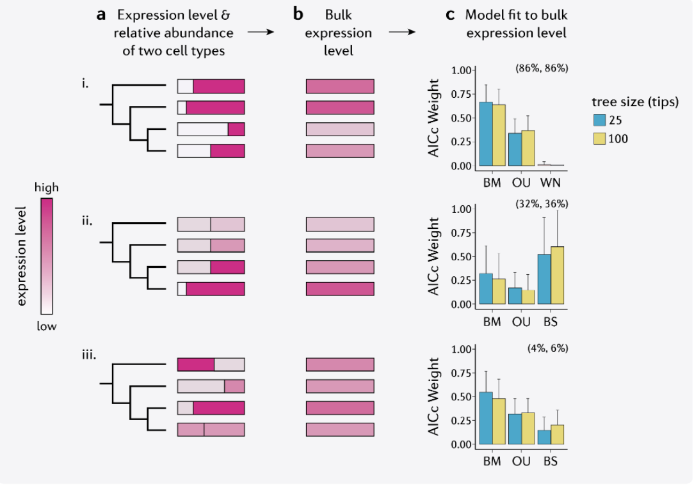

# Inferring gene expression evolution review: Extended Methods for figures 3 and 4

  

  

R scripts and data for the simulation and plotting of gene expression evolution scenarios. See the full manuscript for a description of each simulation scenario.

Go to [file descriptions](file_desription.md) for description of individual scripts
  

All simulations were run in R v.4.1.1 using the following packages:

phytools 
geiger 
phylolm 
OUwie 
tidyr 
MuMIn 
ggplot2 
ggpubr 
dplyr

## General Overview

  

In brief, three gene expression scenarios are laid out to explore the effects of tissue composition differences on the inference of selection when applying phylogenetic comparative methods. The scenarios use a hypothetical tissue, composed of two distinct cell types. Bulk RNAseq is then generated for the entire tissue and the expression value recorded is a function of the relative abundance of each cell type and its expression value.

## Scenario i

  

**Overview**

For scenario i, gene expression values were set at one and two in cell types A and B respectively. Abundance values (pr) were simulated under Brownian Motion for 1000 unique trees of both 25 and 100 tips, using fastBM from phytools. Values were then normalised between 0 and 1. Composite expression values for each individual i were then calculated as follows:

  

expi = (pri x 1) + ((1-pri) x 2) 

  

  

**Model fitting**

Firstly, a static model was fit, using a bootstrapped BM model in phylolm. If the 95% CI for sigma2 crossed 0, a static model was accepted. If rejected, a BM, an OU, and a White Noise model (where the phylogenetic signal was removed by fitting lambda to 0) were fit in phylolm. For the latter three models, Akaike weights were calculated as well as the T1 error rate (the rate at which a non-static model was accepted in favour of the static, relative to if the same set of models were applied to a single-cell type simulation).

  

  

  

## Scenario ii

  

**Overview**

For scenario ii, expression values evolved under BM over 1000 unique phylogenies, of 25 and 100 tips, using fastBM from phytools. Abundance values (pr) were then set to 0.5 across the phylogeny bar one random tip. At this tip the relative abundance of one cell type shifts from 0 to 1 by 0.05 increments. The composite expression value at the shifted tip (t) was calculated as follows:

  

expt = (prt x expAt) + ((1-prt) x expBt)

  

**Model fitting**

An OU, a BM, and an OU with a shift model (where the optimum value is allowed to vary on a single tip) were fit to the calculated composite expression values in OUwie. For the branch shift model, the tip where the abundance shift had occurred, was selected to allow for a varying optimum.

  

## Scenario iii

**Overview**

For scenario iii, expression values evolved under BM with varying covariances between the two cell types (from -1 to 1 in increments of 0.05), with sigma set to 1.0001 for trees of 25 and 100 tips. Simulations for each covariance value were run 1000 times on unique trees. This scenario was run with both a fixed abundance value (50:50 as in scenario ii when pr = 0.5) and with a Brownian evolving abundance value (as in scenario i) (totalling 41,000 simulations per tree size, per abundance setting))

  

expi = (pri x expAi) + ((1-pri) x expBi)

  

  

**Model fitting**

The same models were fit as in scenario ii, however, the tip that was allowed an alternate optimum was randomly allocated. The choice to not allow n branch shift models, where n = number of tips, was due to a branch shift model always being selected, even in single-cell Brownian simulations.

